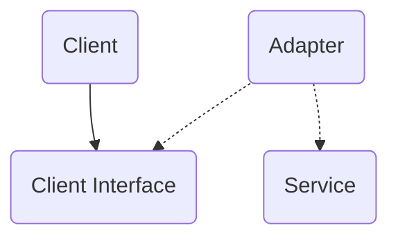

- Structural design patterns deal with inheritance and composition.
- An adapter[^1] is an object that converts the interface of one object to one
that another can understand.
    - Example: A XML to JSON parser
    - Implements the interface of one object and wraps the other (to hide complexity)

- An object adapter works with the client interface
- A class adapter implements the interface of the client and service classes.
- When to use?
    1. An existing class' interface isn't compatible with the rest of a
    system's code.
    2. Reuse existing subclasses that don't have common functionality.

- Implementation
    1. Write client interface to describe interaction between client and service.
    2. Adapter class should have a reference to the service. The service handles
     the business logic.
- Follows Single Responsibility Principle and Open/Closed Principle.
- *However*, sometimes its just easier to make the service compatible with
the rest of your code.

[^1]: *Adapter*. <https://refactoring.guru/design-patterns/adapter>. Accessed 10 May 2024.
