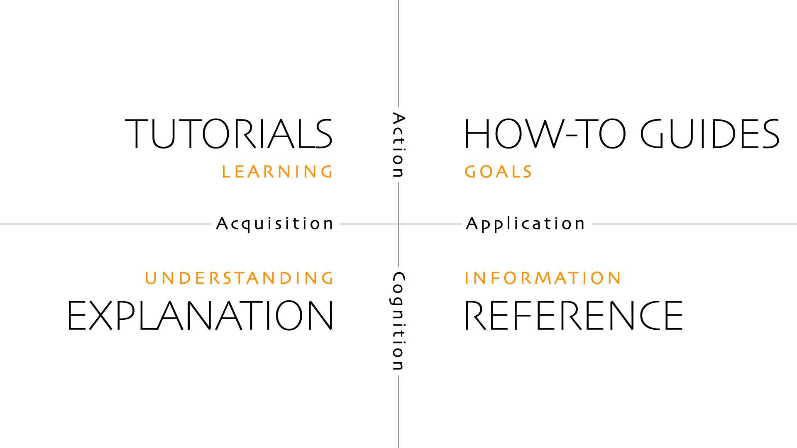

Made by Daniel Procida

!!! info "Foundations"
    Diátaxis is based on the principle that documentation must serve the needs
    of its users. Knowing how to do that means understanding what the needs of users are.[^1]

- Documentation writers are **practitioners** in the domain of a skill[^2].
- A skill's **domain** is defined by a craft
    - A **craft** is the use of a tool or product, or an entire discipline or profession
- **Action**
    - Practical knowledge, knowing how
- **Cognition**
    - Theoretical, knowing that
- The relationship of a practitioner with their practice is that it is something
that needs to be both acquired, and applied.

| need          | addressed in  | the user             | the documentation |
| ------------- | ------------- | -------------------- | ----------------- |
| learning      | tutorials     | acquires their craft | informs action    |
| goals         | how-to guides | applies their craft  | informs action    |
| information   | reference     | applies their craft  | informs cognition |
| understanding | explanation   | acquires their craft | informs cognition |

Map of Territory of Craft: 

[^1]: Bhatti, Jared. Docs for Developers: An Engineer’s Field Guide to Technical Writing. Berkeley, CA: Apress L. P, 2021.
[^2]: “Foundations - Diátaxis.” Accessed November 27, 2024. <https://www.diataxis.fr/foundations/>.
